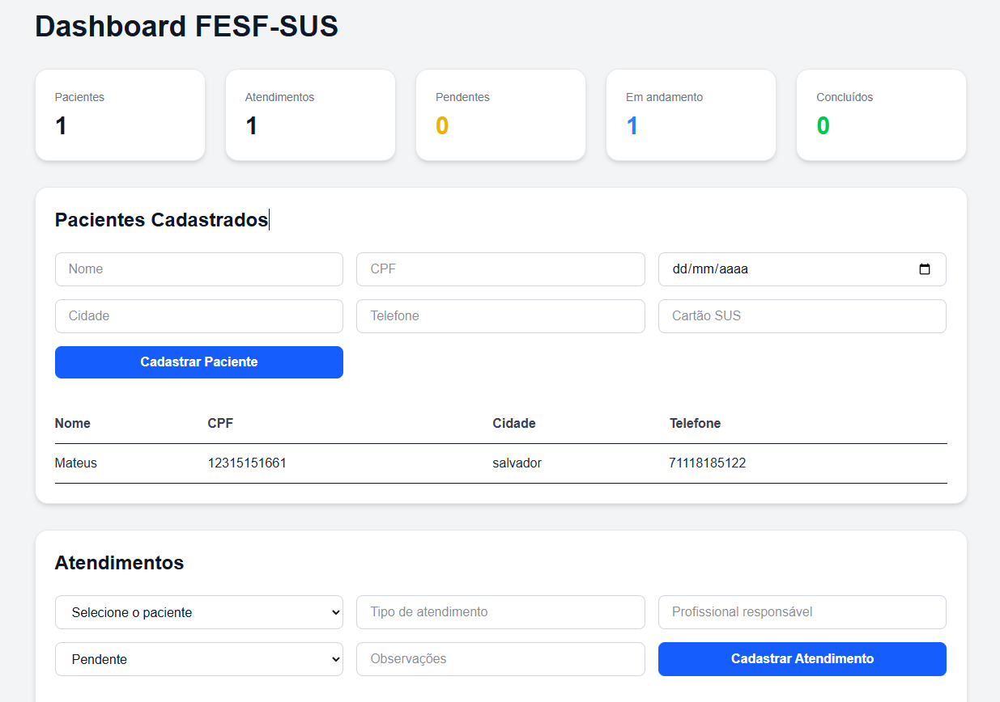
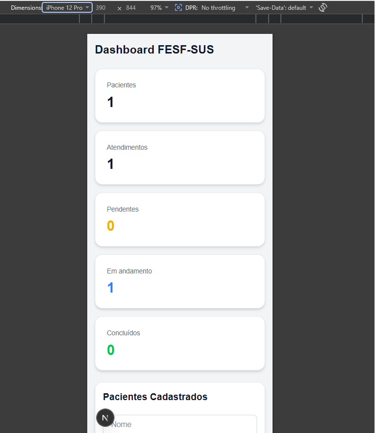
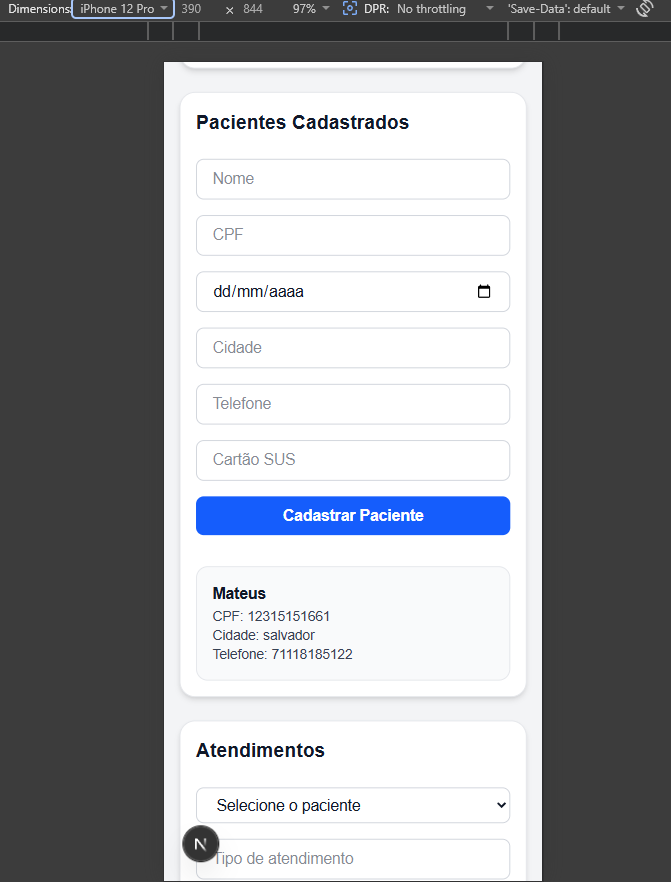
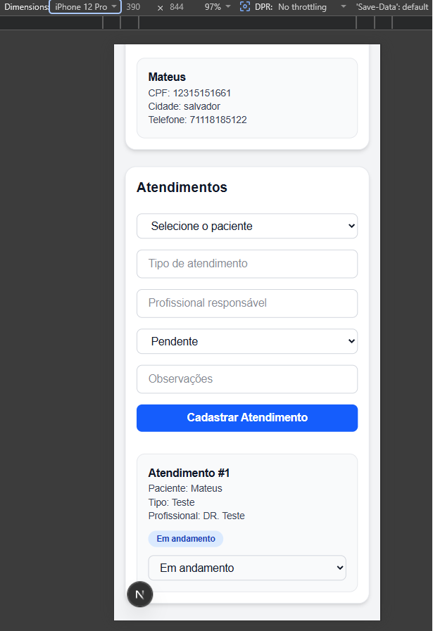
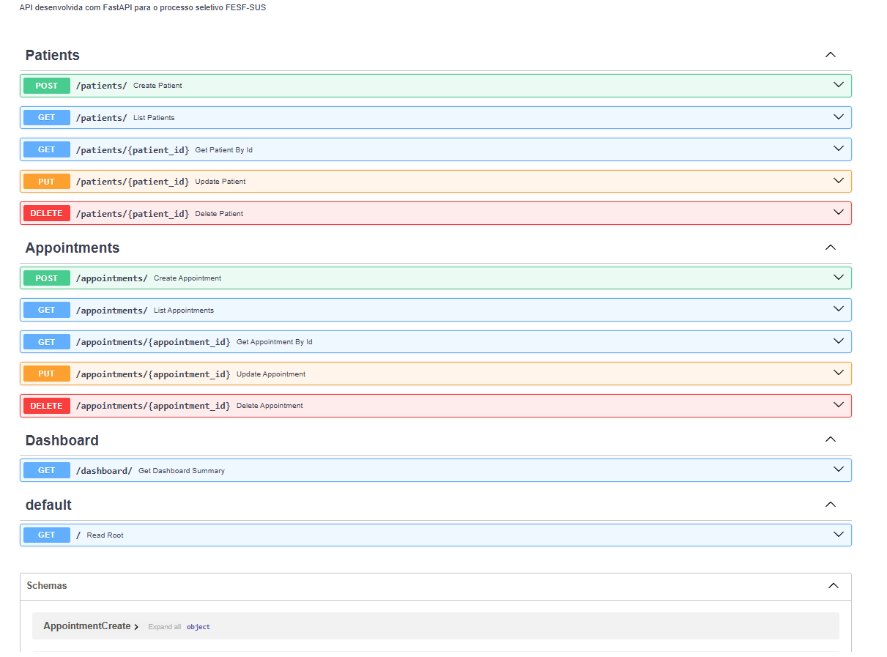

# Seleção FESF-SUS – 1 F.C

Sistema Full Stack desenvolvido para o Processo Seletivo FESF-SUS.

## Sobre o projeto

Aplicação para gestão básica de pacientes e atendimentos, com dashboard de indicadores, cadastro de pacientes, registro de atendimentos e atualização de status.

## Tecnologias utilizadas

### Backend

- Python
- FastAPI
- SQLAlchemy
- PostgreSQL
- Pydantic

### Frontend

- React
- Next.js
- TypeScript
- TailwindCSS

### Infraestrutura

- Docker
- Docker Compose

## Funcionalidades

- Cadastro de pacientes
- Validação de CPF, telefone, nome e cidade
- Cadastro de atendimentos
- Atualização de status dos atendimentos
- Dashboard com indicadores
- Interface responsiva
- API documentada via Swagger

## Como executar com Docker

```bash
docker compose up --build

## Preview

### Dashboard Desktop



### Dashboard Mobile





### Documentação da API


```
